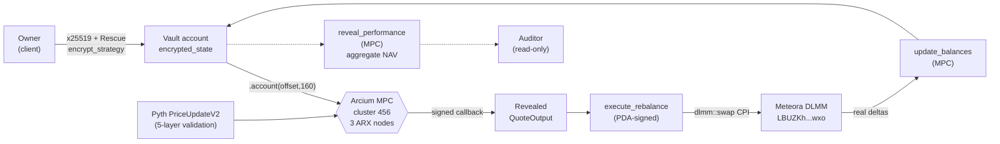

# ShadowPool

**Solana's confidential execution layer — institutions trade and rebalance on-chain without broadcasting their strategy to MEV bots, with selective disclosure for auditors built in.**

Built on Arcium's mainnet-alpha MPC network, Pyth Pull Oracle, and Meteora DLMM. Submission for the [Colosseum Frontier hackathon](https://www.colosseum.com), Apr 6 – May 11, 2026.

```
┌──────────────────────────────────────────────────────────────────────┐
│  encrypted strategy  →  Arcium MPC  →  revealed quote  →  DLMM swap  │
│       (hidden)          (3 nodes)       (on-chain)       (executed)  │
└──────────────────────────────────────────────────────────────────────┘
```

- **Live on devnet:** [`BEu9VWMdba4NumzJ3NqYtHysPtCWe1gB33SbDwZ64g4g`](https://explorer.solana.com/address/BEu9VWMdba4NumzJ3NqYtHysPtCWe1gB33SbDwZ64g4g?cluster=devnet)
- **Audit posture:** 4 High findings closed, 4 Medium closed, 1 documented intent. See [`AUDIT_RESPONSE.md`](AUDIT_RESPONSE.md).
- **Tests:** 30 unit tests + 6 localnet integration tests + 3 Pyth-gated tests; all green.

---

## The problem

$720M in MEV was extracted on Solana in 2025. Roughly half of Solana LPs lose money net of IL + extraction. Every public on-chain position leaks the strategy behind it — spread, thresholds, inventory, direction. Traditional finance solved this decades ago with dark pools, iceberg orders, and sealed RFQs. On Solana, the primitive doesn't exist.

Every tokenized fund entering Solana — BlackRock, Apollo, Franklin Templeton, Citi, Fidelity — hits the same wall: **confidential execution is a prerequisite for serious capital, not a nice-to-have.**

## The primitive

ShadowPool is the confidential execution layer that sits above Solana's public DEXs:

1. Strategy parameters (`spread`, `rebalance_threshold`, inventory balances) stay encrypted inside Arcium's MPC network as `Enc<Mxe, VaultState>`.
2. The network computes a bid/ask quote from encrypted state plus a public oracle price. A single callback reveals only the quotes on-chain.
3. Execution happens through standard DEX CPIs (Meteora DLMM; Jupiter, Phoenix, Orca on the roadmap).
4. After the trade, an MPC call applies the real token deltas to the encrypted state.
5. `reveal_performance` lets an auditor query aggregate NAV without ever seeing the strategy.

The vault in this repo is a **reference implementation** of the primitive. The execution layer underneath is the product.

---

## Architecture



**Trust boundaries:**
- **Plaintext on-chain:** bid/ask quotes (post-reveal), token amounts, addresses, slippage bounds.
- **Plaintext inside MPC:** strategy params, encrypted balances (never reconstructed at a single node).
- **Never visible:** pre-reveal strategy, running encrypted balances, historical strategy state.

See [`submission/whitepaper.md`](submission/whitepaper.md) for the full threat model, circuit specification, and protocol proofs.

---

## Repository layout

```
shadowpool/
├── programs/shadowpool/src/      # Anchor program (Rust)
│   ├── lib.rs                    # 20 instructions + #[arcium_program]
│   ├── state.rs                  # Vault account (MPC-byte-layout-sensitive)
│   ├── contexts.rs               # 18 Accounts structs, seed-bound
│   ├── errors.rs                 # 30 error variants
│   ├── events.rs                 # 12 events
│   ├── constants.rs              # ENCRYPTED_STATE_OFFSET, MAX_CONF_BPS...
│   ├── dlmm_cpi.rs               # Hand-rolled Meteora DLMM swap CPI
│   └── invariant_tests          # cargo test --lib — offset pin, math
├── encrypted-ixs/src/            # Arcis circuits (confidential computation)
│   └── lib.rs                    # 5 circuits: init_vault_state,
│                                 # compute_quotes, update_balances,
│                                 # update_strategy, reveal_performance
├── idls/
│   └── dlmm.json                 # Vendored Meteora DLMM IDL v0.8.2
├── tests/                        # Integration tests (TypeScript + mocha)
├── app/                          # Next.js 16 frontend (React Compiler)
│   └── src/app/
│       ├── page.tsx              # Landing (editorial hero + protocol flow)
│       └── vault/page.tsx        # Vault dashboard
└── submission/                   # Private hackathon assets (gitignored)
    ├── audit-response.md         # Every finding + mitigation
    ├── whitepaper.md             # Technical whitepaper
    ├── demo/                     # 3-min demo script + shot list
    ├── positioning/              # Brand + pitch copy
    └── metrics/                  # MEV savings model, TAM
```

---

## Quickstart

**Prerequisites**

- Rust stable + nightly, Solana CLI 1.51+, Anchor 0.32.1
- Node 20+, Yarn 1.22+
- Docker (for Arcium localnet via `arcium test`)
- A devnet RPC — the free tier drops Arcium uploads; we use [Helius](https://helius.dev/)

**Install + build**

```bash
git clone https://github.com/criptocbas/shadowpool
cd shadowpool
yarn install
cd app && yarn install && cd ..

arcium build          # compile Arcis circuits + Anchor program
```

**Run the dashboard**

```bash
cd app && yarn dev
# open http://localhost:3000
```

**Run tests**

```bash
# Fast unit tests (Rust, ~3s)
cargo test --workspace --lib

# Full integration (Docker + localnet, ~25s)
yarn test

# Clean tests (wipes localnet state first)
yarn test:clean
```

**Deploy to devnet**

```bash
source .env.local          # Helius RPC + wallet path
arcium deploy \
  -k ~/.config/solana/id.json \
  -o 456 \
  -r 4 \
  -u "$ANCHOR_PROVIDER_URL"
```

See [`CLAUDE.md`](CLAUDE.md) for an in-repo operations cookbook (hot paths, gotchas, common flows).

---

## Deployed identifiers

| Role | Identifier | Network |
|---|---|---|
| ShadowPool program | [`BEu9VWMdba4NumzJ3NqYtHysPtCWe1gB33SbDwZ64g4g`](https://explorer.solana.com/address/BEu9VWMdba4NumzJ3NqYtHysPtCWe1gB33SbDwZ64g4g?cluster=devnet) | Solana devnet |
| Meteora DLMM | [`LBUZKhRxPF3XUpBCjp4YzTKgLccjZhTSDM9YuVaPwxo`](https://explorer.solana.com/address/LBUZKhRxPF3XUpBCjp4YzTKgLccjZhTSDM9YuVaPwxo) | Mainnet + devnet (same ID) |
| Pyth SOL/USD feed | [`0xef0d8b6fda2ceba41da15d4095d1da392a0d2f8ed0c6c7bc0f4cfac8c280b56d`](https://insights.pyth.network/price-feeds/Crypto.SOL%2FUSD) | Chain-agnostic |
| Pyth Solana Receiver | `rec5EKMGg6MxZYaMdyBfgwp4d5rB9T1VQH5pJv5LtFJ` | Mainnet + devnet (same ID) |
| Arcium cluster | `456` | devnet |

---

## Security posture

A full professional audit was performed against the Phase-0 state. Four High findings, five Medium, six Low. All High findings closed; Phase-1 hardening also closed the remaining liveness/guard Mediums.

| Finding | Severity | Status | Evidence |
|---|---|---|---|
| H-1 `update_balances` authority | High | Closed | `7572cef` — cranker gate |
| H-2 `compute_quotes` oracle price | High | Closed | `de763d0` — Pyth Pull Oracle integration |
| H-3 transfer-fee accounting | High | Closed | `803da64` — pre/post reload in deposit |
| H-4 Token-2022 extension allow-list | High | Closed | `380c06d` — 6 extensions rejected at init |
| M-1 MPC single-flight guard | Medium | Closed | `803da64` — `pending_state_computation` |
| M-2 NAV escape hatch | Medium | Closed | `803da64` — `emergency_override` |
| M-3 `reveal_performance` unrestricted | Medium | Documented intent | Selective disclosure is the primitive |
| M-4 `nav_basis == 0` guard | Medium | Closed | `9c94969` — `ZeroNavBasis` error |
| M-5 frontend `skipPreflight` | Medium | Closed | `60873c7` |

Full narrative with diffs in [`AUDIT_RESPONSE.md`](AUDIT_RESPONSE.md).

**Defence-in-depth features shipped:**

- Seed binding on every vault-touching context (blocks spoofed-vault delivery from Arcium).
- Cranker authorization model with delegation (`set_cranker`) — authority ≠ cranker possible.
- Five-layer Pyth validation: owner → feed-id (×2) → staleness → sanity → u128 normalization.
- Six-extension Token-2022 allow-list at vault init (permanent delegate, transfer fee, confidential transfer, default frozen, non-transferable, transfer hook — all rejected).
- MPC-anchored slippage floor on DLMM swap (cranker cannot loosen beyond 5% cap).
- Single-flight MPC guard with both-path callback cleanup (abort included).
- Authority escape hatch for stuck liveness flags, logged via `EmergencyOverrideEvent`.

---

## Tech stack

| Layer | Tooling |
|---|---|
| Confidential computation | [Arcium](https://arcium.com) mainnet-alpha, Arcis (Rust-based MPC DSL) |
| Oracle | [Pyth Pull Oracle](https://pyth.network) + Hermes VAA |
| DEX | [Meteora DLMM](https://meteora.ag) (CPI) |
| Token standard | SPL Token + [Token-2022](https://spl.solana.com/token-2022) via `anchor_spl::token_interface` |
| Program framework | [Anchor](https://anchor-lang.com) 0.32.1 |
| Frontend | Next.js 16 + React 19 + Tailwind v4 + `@coral-xyz/anchor` |
| Wallet | `@solana/wallet-adapter-*` |

---

## Status + roadmap

**Shipped (devnet live):**
- 20 Anchor instructions, 5 Arcis circuits, all reject paths covered.
- Pyth Pull Oracle integration end-to-end.
- Meteora DLMM swap CPI with vault-PDA signer.
- NAV-aware share pricing, staleness guards, slippage caps.
- Frontend with editorial typography + terminal-style live preview.
- 30 unit tests + 6 localnet integration tests green.

**Phase 2 (post-hackathon, pre-mainnet):**
- Fee accounting (`mgmt_fee_bps`, `perf_fee_bps`, high-water mark).
- Auditor-view instruction + dashboard surface.
- Trustless cranker promotion (`set_cranker` shipped; UI flow pending).
- Live MEV-savings counter on the dashboard.
- Squads multisig program-upgrade authority.

**Phase 3 (mainnet):**
- Jupiter + Phoenix + Orca CPI adapters.
- Multi-asset vaults + correlation-aware strategies.
- SDK for third-party integrators.
- Institutional custody integrations.

---

## Repository provenance

This repo is an active hackathon submission. Every commit on `main` ties back to a concrete engineering item — security finding, audit recommendation, or feature ship. The commit history is the engineering log.

```bash
git log --oneline                 # see the full build sequence
cargo test --workspace --lib       # verify the math
arcium build && yarn test          # verify the on-chain flow
```

If anything in this README doesn't match the deployed state, the code wins. Please [open an issue](https://github.com/criptocbas/shadowpool/issues).

---

## Team

**Crypto CBas** (`@criptocbas`) — building at the intersection of on-chain market making + privacy primitives. 18 months live MM on Solana (Backpack VIP 5, Meteora DLMM, Jupiter, Phoenix). Authored `salary-benchmark-circuits` (Arcium, March 2026). Won the Solana Privacy Hack with [HiddenHand](https://github.com/criptocbas/hiddenhand) (on-chain privacy poker, FHE + VRF + Ed25519).

---

## License

MIT — see [`LICENSE`](LICENSE).

---

## Links

- **Live demo**: [shadowpool.app](https://shadowpool.app) *(pending final DNS)*
- **Pitch deck + founder letter**: [`submission/`](submission/) *(gitignored; request access)*
- **Twitter / X**: [`@criptocbas`](https://x.com/criptocbas)
- **Blog**: [cryptocbas.dev](https://cryptocbas.dev)

<sub>Built on Solana × Arcium · Colosseum Frontier 2026</sub>
