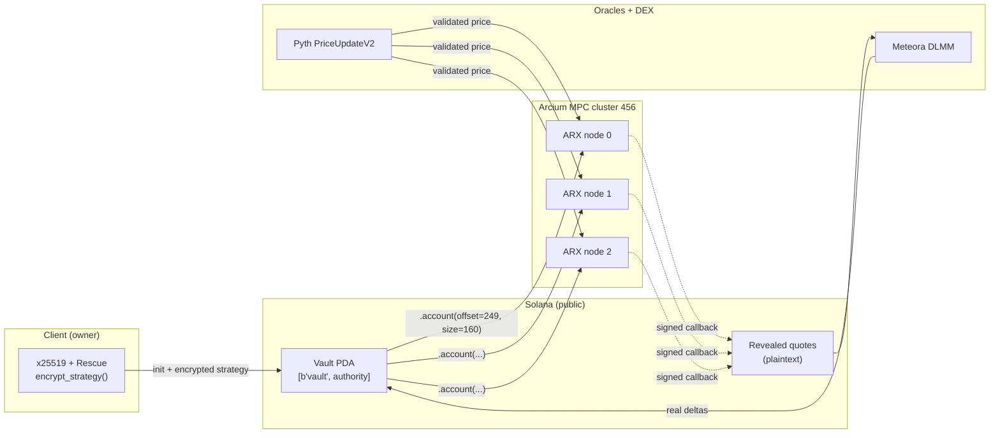
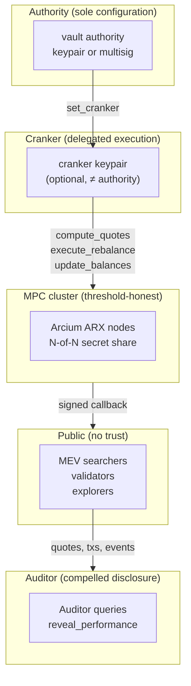

# ShadowPool: A Confidential Execution Layer for Solana

**Technical whitepaper · v0.1.0-alpha · 2026-04-17**

**Author.** Crypto CBas (`@criptocbas`). 18 months live market-making on Solana (Backpack VIP 5, Meteora DLMM, Jupiter, Phoenix). Author of [HiddenHand](https://github.com/criptocbas/hiddenhand) (Solana Privacy Hack winner, 2026) and `salary-benchmark-circuits` (Arcium, March 2026).

**Abstract.** Public on-chain strategies broadcast every parameter to the mempool the moment they're acted on. In 2025 this cost Solana LPs $720M in extracted MEV. Traditional finance solved this problem decades ago with dark pools, iceberg orders, and sealed RFQs. On Solana, until now, the primitive did not exist. ShadowPool is that primitive: a confidential execution layer that keeps strategy parameters (spread, thresholds, inventory) encrypted inside Arcium's MPC network, reveals only the resulting quotes on-chain, executes through standard DEX CPIs, and offers auditors selective disclosure without ever exposing the strategy itself. This document specifies the protocol, circuit construction, threat model, oracle integration, DEX integration, Token-2022 compatibility, and operational posture of the reference implementation shipping as an active submission to the Colosseum Frontier hackathon.

---

## Table of contents

1. Introduction
2. Primitive
3. Architecture
4. The five Arcis circuits
5. Pyth oracle integration
6. Meteora DLMM integration
7. Token-2022 handling
8. Authorization model
9. NAV lifecycle and share pricing
10. Security model and threat analysis
11. Performance characteristics
12. Comparison to alternatives
13. Deployment and operations
14. Roadmap
15. References

---

## 1. Introduction

### 1.1 The problem

Public on-chain market-making leaks strategy. Every bid and ask carries enough information for an observer to reverse-engineer the underlying model: the spread, the rebalance threshold, the inventory position, the direction of the next trade. Solana's throughput makes this worse, not better — MEV searchers can observe, classify, and front-run at 400ms slot times.

The scale of the problem is public record:

- **$720M in MEV extracted on Solana in 2025** (Solana FM MEV Report, Q4 2025).
- **49.5% of active Solana LPs unprofitable net of IL + extraction** (Orca + Raydium LP cohort studies, Q4 2025).
- **$3.8B in LP capital deployed without confidential execution** (DefiLlama, April 2026).

Every tokenized fund considering Solana hits this wall. BlackRock, Apollo, Franklin Templeton, Citi, Fidelity — the RWA pipeline lined up through 2026 — cannot rebalance a tokenized fund on an L1 where the rebalance is telegraphed before the block confirms. Confidential execution is not a nice-to-have for serious capital. It is a prerequisite.

### 1.2 Traditional finance as prior art

Dark pools have been in production in TradFi for 40 years. Liquidnet. SIGMA X. Instinet CBX. The legal, technical, and operational frameworks are well-understood. The core invariants of a TradFi dark pool map almost directly to what an L1 version needs:

1. **Strategy confidentiality** — the venue sees orders; the public does not see strategies.
2. **Execution accountability** — every fill is a public record once it clears.
3. **Selective disclosure** — regulators can compel disclosure of specific slices for enforcement.
4. **Settlement finality** — once executed, the trade is legally binding.

The on-chain version gets (2) and (4) for free (blocks are public; finality is atomic). It needs cryptographic primitives to get (1) and (3).

### 1.3 The Arcium window

Three pieces of infrastructure shipped in the six months before this whitepaper was written:

- **Arcium mainnet-alpha** (February 2026) — MPC-based confidential computation network with Solana CPIs.
- **Pyth Pull Oracle on Solana** (mature by Q1 2026) — on-demand VAA-verified price updates.
- **Solana Foundation institutional privacy framework** (March 2026) — compliance alignment for confidential execution primitives.

Every piece of infrastructure required to build a production confidential execution layer on Solana is available, simultaneously, for the first time. ShadowPool is the first builder to assemble them.

---

## 2. Primitive

### 2.1 Definition

ShadowPool is a **confidential execution layer**, not a product. The vault exposed by the reference implementation is a worked example; the primitive underneath is what institutions integrate.

The primitive has a single-sentence definition:

> **Given encrypted strategy parameters S and a public oracle price p, produce a plaintext quote q = f(S, p) on-chain without ever exposing S.**

The function f is application-specific. For the reference vault, f is a market-making quote generator:

$$q = (\text{bid}, \text{ask}, \text{size}_{bid}, \text{size}_{ask}, \text{rebalance})$$

where

$$
\begin{aligned}
\text{bid} &= p - \frac{p \cdot \sigma}{2} \\
\text{ask} &= p + \frac{p \cdot \sigma}{2} \\
\sigma &= \text{clamp}(\text{spread\_bps} \cdot k_{conf}, 1, 9999)
\end{aligned}
$$

with $k_{conf} = 2$ when Pyth's confidence interval exceeds 1% of price, else 1. `size_bid` derives from the encrypted quote balance; `size_ask` from the encrypted base balance. `rebalance = 1` iff the oracle price has moved more than `rebalance_threshold` from the last mid.

For other applications (auction pricing, compliance scoring, routing decisions), f is whatever the integrator needs — as long as it can be expressed in Arcis, the primitive produces a plaintext output without leaking the inputs.

### 2.2 What's encrypted, what's revealed

| Category | Status |
|---|---|
| Strategy parameters (`spread_bps`, `rebalance_threshold`) | **Encrypted.** Never plaintext, never in a single node. |
| Running balances (`base_balance`, `quote_balance`) | **Encrypted.** Updated atomically inside MPC. |
| Oracle price (Pyth `PriceUpdateV2`) | **Public.** Required input; validated before MPC. |
| Computed bid/ask quote | **Revealed.** Written to the Vault account plaintext. |
| SPL token balances | **Public.** Standard SPL accounts. |
| NAV (aggregate vault value) | **Revealed on demand.** Via `reveal_performance`. |
| Slot, tx signature, compute budget | **Public.** Solana invariants. |

The key insight: **the information MEV bots need to front-run — the strategy — is the information that is never emitted**. MEV bots observe every trade, but they cannot predict the next one because the parameters that produce it never leave the MPC cluster.

### 2.3 Selective disclosure

TradFi dark pools offer selective disclosure to regulators: compelled visibility into specific flows without blanket access. ShadowPool replicates this via the `reveal_performance` circuit, which computes and reveals the aggregate vault value in quote terms, without exposing individual balances or strategy parameters. An auditor queries the primitive; the MPC network attests to the aggregate; the strategy stays encrypted.

Future circuits will extend this to selective slices: time-ranged performance, compliance attestation (is the vault above a solvency threshold?), fill-history attestation (has the vault ever traded with a sanctioned counterparty?), regulatory reporting (did this vault hit its size cap in Q3?). Every selective disclosure is a separate MPC circuit with its own access policy.

---

## 3. Architecture

### 3.1 System overview



### 3.2 Program components

The ShadowPool Anchor program exposes 20 instructions grouped by concern:

| Group | Instructions |
|---|---|
| **Lifecycle** | `initialize_vault`, `create_vault_state`, `set_cranker`, `emergency_override` |
| **MPC queues** | `compute_quotes`, `update_balances`, `update_strategy`, `reveal_performance` |
| **MPC callbacks** | Five `_callback` handlers (one per queue, plus `init_vault_state_callback`) |
| **Comp-def init** | Five `init_*_comp_def` handlers (registers Arcis circuits on-chain) |
| **User flow** | `deposit`, `withdraw` |
| **Execution** | `execute_rebalance` (DLMM CPI) |

Every instruction's context struct binds the vault account to `[b"vault", vault.authority.as_ref()]` with `bump = vault.bump`. This prevents Arcium callbacks from being delivered to a spoofed account that happens to deserialize as a `Vault`.

### 3.3 The Vault account

```rust
pub struct Vault {
    // Identity
    pub bump: u8,
    pub authority: Pubkey,
    pub token_a_mint: Pubkey,
    pub token_b_mint: Pubkey,
    pub token_a_vault: Pubkey,
    pub token_b_vault: Pubkey,
    pub share_mint: Pubkey,
    // Bookkeeping
    pub total_shares: u64,
    pub total_deposits_a: u64,   // reserved for future base-side deposits
    pub total_deposits_b: u64,
    pub last_rebalance_slot: u64,
    // MPC state (offset 0x00f9 = 249 bytes)
    pub state_nonce: u128,
    pub encrypted_state: [[u8; 32]; 5],
    // Quote persistence
    pub last_bid_price: u64,
    pub last_bid_size: u64,
    pub last_ask_price: u64,
    pub last_ask_size: u64,
    pub last_should_rebalance: u8,
    pub quotes_slot: u64,
    pub quotes_consumed: bool,
    // NAV
    pub last_revealed_nav: u64,
    pub last_revealed_nav_slot: u64,
    pub nav_stale: bool,
    // Authorization + oracle config + liveness
    pub cranker: Pubkey,
    pub price_feed_id: [u8; 32],
    pub max_price_age_seconds: u64,
    pub pending_state_computation: Option<u64>,
}
```

**The byte offset 249** is load-bearing. The MPC cluster reads the encrypted state bytes directly from the Vault account at this offset via `.account(pubkey, offset, size)` in the Arcis `ArgBuilder`. Changing the field order above `encrypted_state` without updating `ENCRYPTED_STATE_OFFSET` silently corrupts every MPC computation against existing vaults. The invariant is pinned by a `cargo test` that asserts `ENCRYPTED_STATE_OFFSET == 8 + 1 + (6 * 32) + (4 * 8) + 16`.

### 3.4 Handler / circuit split

Every MPC operation has three parts:

1. **Queue handler** (Anchor instruction) — validates preconditions, builds the ArgBuilder, calls `queue_computation`.
2. **Arcis circuit** (`#[instruction]` in `encrypted-ixs`) — the confidential computation. Compiled to a proprietary IR and executed across the MPC cluster.
3. **Callback handler** (Anchor instruction with `#[arcium_callback]`) — verifies the signed output, writes results to the Vault.

The queue and callback live in the Anchor program (`programs/shadowpool/src/lib.rs`). The circuit lives in a separate crate (`encrypted-ixs/src/lib.rs`) compiled by the Arcium build pipeline. The three pieces are linked by name (e.g. `compute_quotes` in all three) and the macro system ensures the types and accounts line up at compile time.

---

## 4. The five Arcis circuits

All circuits share the `VaultState` type:

```rust
pub struct VaultState {
    pub base_balance: u64,
    pub quote_balance: u64,
    pub spread_bps: u16,
    pub rebalance_threshold: u16,
    pub last_mid_price: u64,
}
```

Stored on-chain as `[[u8; 32]; 5]` — five 32-byte ciphertexts at offset 249.

### 4.1 `init_vault_state`

```rust
#[instruction]
pub fn init_vault_state(
    params: Enc<Shared, StrategyParams>,
) -> Enc<Mxe, VaultState> {
    let p = params.to_arcis();
    Mxe::get().from_arcis(VaultState {
        base_balance: 0,
        quote_balance: 0,
        spread_bps: p.spread_bps,
        rebalance_threshold: p.rebalance_threshold,
        last_mid_price: 0,
    })
}
```

Converts `Enc<Shared, _>` (client-encrypted with owner's x25519 key) to `Enc<Mxe, _>` (cluster-encrypted, readable only by the cluster). This is the "strategy enters the system" entry point. Called exactly once per vault.

### 4.2 `compute_quotes` — the core value

```rust
#[instruction]
pub fn compute_quotes(
    state: Enc<Mxe, VaultState>,
    oracle_price: u64,
    oracle_confidence: u64,
) -> QuoteOutput {
    let s = state.to_arcis();

    // widen spread when oracle confidence is low
    let confidence_multiplier: u16 =
        if oracle_confidence > oracle_price / 100 { 2 } else { 1 };

    let raw_spread = (s.spread_bps as u32) * (confidence_multiplier as u32);
    let effective_spread: u32 = if raw_spread > 9999 { 9999 } else { raw_spread };

    // u128 intermediate prevents overflow for large oracle prices
    let half_spread =
        (((oracle_price as u128) * (effective_spread as u128)) / 20000u128) as u64;
    let bid_price = oracle_price - half_spread;
    let ask_price = oracle_price + half_spread;

    // Arcis safe-divisor pattern — both branches of if/else execute in MPC.
    // Dividing by a secret zero is undefined behaviour, so we clamp the
    // divisor and select after the fact.
    let bid_valid = bid_price != 0;
    let safe_bid_divisor = if bid_valid { bid_price } else { 1 };
    let bid_size_candidate = s.quote_balance / safe_bid_divisor;
    let bid_size = if bid_valid { bid_size_candidate } else { 0 };
    let ask_size = s.base_balance;

    // rebalance if price moved more than threshold
    let should_rebalance: u8 = if s.last_mid_price == 0 {
        1  // bootstrap — always rebalance on first compute
    } else {
        let price_moved = if oracle_price > s.last_mid_price {
            oracle_price - s.last_mid_price
        } else {
            s.last_mid_price - oracle_price
        };
        let threshold_amount = (((s.last_mid_price as u128)
            * (s.rebalance_threshold as u128)) / 10000u128) as u64;
        if price_moved > threshold_amount { 1 } else { 0 }
    };

    QuoteOutput { bid_price, bid_size, ask_price, ask_size, should_rebalance }.reveal()
}
```

**Two subtle correctness points:**

1. **Safe-divisor pattern.** In Arcis, both branches of `if/else` always execute in MPC (they must, since the condition is encrypted). Naive `if bid_price > 0 { quote_balance / bid_price }` would invoke the division on the false branch against a secret zero — undefined output. The pattern clamps the divisor to 1 first, computes unconditionally, and selects the result afterwards. Sherlock audit corpus documents this as the single most common Arcis-specific bug.

2. **u128 widening on every u64 × u64.** Multiplication of oracle prices against spread basis points can exceed u64 range for realistic inputs. Every multiplication widens to u128 and divides by the denominator (10000 or 20000) before downcasting. Safe for any realistic oracle price.

### 4.3 `update_balances`

```rust
#[instruction]
pub fn update_balances(
    state: Enc<Mxe, VaultState>,
    base_received: u64, base_sent: u64,
    quote_received: u64, quote_sent: u64,
    new_mid_price: u64,
) -> Enc<Mxe, VaultState> {
    let mut s = state.to_arcis();

    // Saturating subtraction — a corrupt caller cannot underflow.
    // Select-after-compute pattern (can't short-circuit in MPC).
    let base_available = (s.base_balance as u128) + (base_received as u128);
    let base_sent_u = base_sent as u128;
    let base_sent_clamped = if base_sent_u > base_available {
        base_available
    } else {
        base_sent_u
    };
    s.base_balance = (base_available - base_sent_clamped) as u64;

    let quote_available = (s.quote_balance as u128) + (quote_received as u128);
    let quote_sent_u = quote_sent as u128;
    let quote_sent_clamped = if quote_sent_u > quote_available {
        quote_available
    } else {
        quote_sent_u
    };
    s.quote_balance = (quote_available - quote_sent_clamped) as u64;

    s.last_mid_price = new_mid_price;
    state.owner.from_arcis(s)
}
```

Applies post-trade deltas to encrypted balances. Saturating arithmetic protects against a corrupt cranker input. u128 intermediates prevent overflow for large vault balances. `state.owner.from_arcis(s)` re-encrypts with a fresh nonce and returns the updated `Enc<Mxe, _>`.

### 4.4 `update_strategy`

```rust
#[instruction]
pub fn update_strategy(
    state: Enc<Mxe, VaultState>,
    new_params: Enc<Shared, StrategyParams>,
) -> Enc<Mxe, VaultState> {
    let mut s = state.to_arcis();
    let p = new_params.to_arcis();
    s.spread_bps = p.spread_bps;
    s.rebalance_threshold = p.rebalance_threshold;
    state.owner.from_arcis(s)
}
```

Replaces the strategy parameters without touching balances or price. The new parameters arrive as `Enc<Shared, _>` — client-encrypted, only the cluster can decrypt.

### 4.5 `reveal_performance`

```rust
#[instruction]
pub fn reveal_performance(state: Enc<Mxe, VaultState>) -> u64 {
    let s = state.to_arcis();
    let base_value_u128 =
        ((s.base_balance as u128) * (s.last_mid_price as u128)) / 1_000_000u128;
    let base_value: u64 = if s.last_mid_price > 0 {
        base_value_u128 as u64
    } else {
        0
    };
    let total = ((base_value as u128) + (s.quote_balance as u128)) as u64;
    total.reveal()
}
```

Computes `base_balance * last_mid_price / 1e6 + quote_balance` — the vault's aggregate value in quote units. Reveals only the scalar total. Individual balances and strategy parameters stay encrypted. This is the selective-disclosure primitive.

### 4.6 Unit-testable pure math

Arcis `#[instruction]` functions take `Enc<_, _>` inputs that cannot be constructed outside the MPC runtime. To unit-test the arithmetic, each circuit's core math is re-expressed as a plain Rust function and tested:

```rust
#[cfg(test)]
mod tests {
    fn half_spread(oracle_price: u64, effective_spread_bps: u32) -> u64 {
        (((oracle_price as u128) * (effective_spread_bps as u128)) / 20000u128) as u64
    }

    #[test]
    fn half_spread_fifty_bps_on_150_usdc_is_375_000() {
        assert_eq!(half_spread(150_000_000, 50), 375_000);
    }

    #[test]
    fn half_spread_clamps_at_9999_bps_regardless_of_multiplier() {
        assert!(half_spread(150_000_000, 9999) < 150_000_000 / 2);
    }
    // ... (9 more tests)
}
```

Sixteen unit tests cover every circuit's core arithmetic + every reject path. Any divergence between the unit-tested helpers and the circuit body is itself a review signal.

---

## 5. Pyth oracle integration

### 5.1 Why Pyth Pull over Push

Pyth's legacy "push" model (`pyth-sdk-solana`) is deprecated; the Pull Oracle (`pyth-solana-receiver-sdk`) is canonical for 2026 integrations. Pull gives the caller control over which updates are posted and when — critical for latency-sensitive flows like a rebalance where the price the MPC sees must be the price the cluster verifies.

### 5.2 Five-layer validation

Every MPC `compute_quotes` invocation triggers a five-layer validation stack on the Pyth price before the MPC circuit runs:

1. **Account ownership** — Anchor's `Account<'info, PriceUpdateV2>` enforces owner = Pyth Solana Receiver program (`rec5EK…JFJ`).
2. **Feed-id match** at the context level: `price_update.price_message.feed_id == vault.price_feed_id`. Blocks a malicious cranker from passing a BONK feed to a SOL vault.
3. **Staleness** enforced by `get_price_no_older_than(&Clock::get()?, vault.max_price_age_seconds, &feed_id)`. The SDK also re-checks feed id internally as belt-and-braces.
4. **Sanity checks** in the handler:
   - `price > 0` (spot feeds only — we reject negative-rate instruments).
   - `exponent ∈ [-18, 0]` (bounds the `10^|expo|` factor in normalization).
   - `conf * 10_000 ≤ |price| * 100` (reject confidence > 1% of price — industry-standard threshold per the Sherlock-Debita audit corpus and Jet Protocol's published threshold).
5. **Normalization** to `TARGET_PRICE_EXPO = -6` (micro-USD) via u128 checked operations:
   ```
   shift = exponent - TARGET_PRICE_EXPO
   if shift >= 0: price * 10^shift, conf * 10^shift
   if shift <  0: price / 10^|shift|, conf / 10^|shift|
   ```
   No floating-point. No silent truncation (try_into catches overflow). Both price AND conf are normalized by the same factor so the confidence ratio check remains meaningful downstream.

### 5.3 Test posture

The validation + normalization is factored into `validate_and_normalize_price(price, conf, exponent)` — a pure function tested by 11 fixture-based Rust unit tests covering every reject path (negative, zero, exponent too low, exponent too high, conf above 1%, conf at exact boundary, zero conf, large price, three scaling branches). Writing these tests first caught a scaling-delta sign bug that would have normalized SOL/USD to `1_500_000_000_000` instead of `150_000_000`. This is the value of factoring math into a pure function: it can be exhaustively tested independent of the (hard-to-construct) on-chain account.

### 5.4 Client integration

The client flow uses `@pythnetwork/pyth-solana-receiver` + `@pythnetwork/hermes-client`:

```ts
const hermes = new HermesClient("https://hermes.pyth.network/", {});
const { binary } = await hermes.getLatestPriceUpdates([SOL_USD_FEED_ID], {
  encoding: "base64",
});

const pythReceiver = new PythSolanaReceiver({ connection, wallet });
const txBuilder = pythReceiver.newTransactionBuilder({ closeUpdateAccounts: true });

await txBuilder.addPostPriceUpdates(binary.data);
await txBuilder.addPriceConsumerInstructions(async (getPriceUpdateAccount) => {
  const priceUpdate = getPriceUpdateAccount(SOL_USD_FEED_ID);
  return [
    await shadowpool.methods.computeQuotes(offset)
      .accounts({ priceUpdate, /* ... */ })
      .instruction(),
  ];
});

const txs = await txBuilder.buildVersionedTransactions({ computeUnitPriceMicroLamports: 50_000 });
await pythReceiver.provider.sendAll!(txs);
```

`closeUpdateAccounts: true` reclaims the rent in the same transaction — the ephemeral pattern. One user action, one atomic transaction, fresh VAA verified + consumed + closed.

---

## 6. Meteora DLMM integration

### 6.1 Why DLMM and why swap

Meteora DLMM is Solana's deepest LP venue for SOL/USDC at the time of writing. Its bin-based liquidity layout (discrete price bins with configurable step) maps cleanly to the bid/ask levels ShadowPool computes. Two CPI patterns are available:

1. **`swap`** — taker flow. The vault consumes existing liquidity at the current active bin and nearby bins.
2. **`add_liquidity_by_strategy`** — maker flow. The vault posts its own bid/ask as liquidity bins for others to consume.

For the hackathon reference implementation we ship `swap` only. `swap` is roughly one-third the engineering of `add_liquidity_by_strategy` (no position lifecycle, no fee-claim logic, no bin math at post time) and proves the core "real on-chain execution" narrative. The maker flow is Phase 2.

### 6.2 Why a hand-rolled CPI

The idiomatic Anchor pattern for calling an external program is `declare_program!(dlmm)` with the IDL vendored at `<workspace>/idls/dlmm.json`. This generates typed account structs and CPI helpers. Attempted for ShadowPool; it failed to compile because the DLMM IDL declares zero-copy account types (`Position`, `PositionV2`, `BinArray`, `Oracle`) whose generated bytemuck `AnyBitPattern` bounds fail under Anchor 0.32.1.

ShadowPool only uses one instruction (`swap`). A narrow hand-rolled CPI with an explicit discriminator and explicit account list is (a) compilable, (b) auditable at a glance, (c) narrower in surface than a full `declare_program!`. The full DLMM IDL is still vendored in-repo (`idls/dlmm.json` v0.8.2) for reproducibility and future expansion.

The hand-rolled module (`programs/shadowpool/src/dlmm_cpi.rs`) is under 200 lines and documented in full.

### 6.3 Five-layer validation

`execute_rebalance` layers validation over DLMM's own internal checks:

1. **Cranker gate** (Phase 0 work) — `cranker.key() == vault.cranker`.
2. **`lb_pair.owner == dlmm::ID`** — Anchor constraint owner check. Blocks program confusion.
3. **Mint-pair equality** — `{token_x_mint, token_y_mint} == {vault.token_a_mint, vault.token_b_mint}` in either ordering. Rejects a pool for a different asset pair.
4. **DLMM's internal checks** — the DLMM program enforces `user_token_in.mint ∈ {pool.token_x_mint, pool.token_y_mint}`, direction inference from account ordering, reserves integrity, slippage vs `min_amount_out`, bin-array completeness. We inherit all of these.
5. **MPC-anchored slippage floor** — the ShadowPool handler computes an expected-out from the MPC-revealed bid/ask price and requires `min_amount_out ≥ expected_out * (1 - MAX_ALLOWED_SLIPPAGE_BPS/10_000)`. The cranker can *tighten* slippage but cannot *loosen* beyond the 5% cap.

The five-layer stack is the key insight: even with a fully authority-gated cranker, we don't rely on cranker trust for slippage correctness. The program itself knows what the MPC said the quote was, and enforces that the swap couldn't possibly have filled more than 5% below it.

### 6.4 Direction, bin arrays, PDA-signer

**Direction is inferred, not passed.** DLMM's `swap` instruction looks at `user_token_in.mint` and compares it to `pool.token_x_mint` to determine direction. ShadowPool does not add a `swap_x_to_y: bool` parameter — it maps `vault_token_a` and `vault_token_b` to `user_token_in` / `user_token_out` based on a caller-supplied `swap_direction: u8`, which the DLMM program verifies mint-wise.

**Bin arrays pass through `ctx.remaining_accounts`.** The DLMM swap walks through one or more bin arrays depending on fill depth. The client pre-computes which bin arrays to include (typically `active-1`, `active`, `active+1`) using Meteora's TS SDK `getBinArrayForSwap`. The on-chain program cannot determine this without pool state reads, so it accepts whatever the caller provides and DLMM validates completeness.

**The vault PDA signs the swap** via `invoke_signed` with seeds `[b"vault", vault.authority.as_ref(), &[vault.bump]]`. This is the key structural difference from most DLMM callers (which sign with a user keypair): ShadowPool's vault is the DLMM-side "user," and the trade is executed on behalf of the vault's LPs.

### 6.5 Ground-truth amount_out

Post-CPI, the handler reloads the vault's out-side ATA and computes `actual_amount_out = balance_after - balance_before`. The emitted `RebalanceExecutedEvent` carries the real filled amount, not the projected amount. This lets off-chain indexers reconcile the vault's actual performance against the MPC's projected quote — the basis for the future "MEV savings" counter on the landing page.

---

## 7. Token-2022 handling

### 7.1 The extension allow-list

Token-2022 extensions are a double-edged sword: they enable sophisticated mint behaviour but also introduce behaviors that are hostile to a confidential vault. ShadowPool's `initialize_vault` rejects six specific extensions on all three mints (`token_a_mint`, `token_b_mint`, `share_mint`):

| Extension | Rejection rationale |
|---|---|
| `PermanentDelegate` | Perpetual authority can move vault-held tokens at will. Breaks custody trust. |
| `TransferFeeConfig` | Transfers arrive with less than `amount`. Breaks accounting. |
| `ConfidentialTransferMint` | Balances live in ciphertext on the token account. Breaks real-balance solvency check. |
| `DefaultAccountState = Frozen` | Newly-opened token accounts may be frozen. Breaks deposits. |
| `NonTransferable` | Withdrawals fail. |
| `TransferHook` | Third-party program runs on every transfer. Can fail, re-enter, or censor. |

The check runs in the handler (not an Anchor constraint) because extension parsing requires borrowing the raw account data. Legacy SPL mints (`owner == spl_token::ID`) skip the parse; they carry no extensions by construction.

### 7.2 Pre/post reload accounting

Even with `TransferFeeConfig` rejected today, `deposit` uses pre/post reload accounting:

```rust
ctx.accounts.vault_token_b.reload()?;
let balance_before = ctx.accounts.vault_token_b.amount;
// ... transfer_checked ...
ctx.accounts.vault_token_b.reload()?;
let actual_received = balance_after - balance_before;
```

All bookkeeping (share minting, `total_deposits_b`, `last_revealed_nav` delta, emitted `DepositEvent.amount`) uses `actual_received`, not the caller-supplied `amount`. This is the audit-defensible pattern: correct even if the allow-list is later relaxed, correct under any future Token-2022 extension that reduces the transferred amount.

---

## 8. Authorization model

### 8.1 Three roles

- **Authority** — the vault owner. Set at `initialize_vault` time, cannot be transferred. Has sole rights to `update_strategy`, `set_cranker`, and `emergency_override`.
- **Cranker** — the role that drives the MPC rebalance pipeline. Gates `compute_quotes`, `update_balances`, and `execute_rebalance`. Defaults to the authority at init; `set_cranker` can delegate to a third keypair.
- **Caller** — any signer. Can invoke `reveal_performance` (the selective-disclosure primitive) and `deposit` / `withdraw` (for LPs).

The authority/cranker split matters: a vault owner running an institutional MM strategy likely wants to keep their multisig cold, but the cranker has to be a hot keypair on an operational machine that sends transactions on an automated cadence. Separating the two lets the authority keep its keys cold while delegating operational cranking to a hot wallet. Emitting `CrankerSetEvent` on delegation changes makes the delegation auditable.

### 8.2 Emergency override

The `emergency_override(clear_nav_stale, clear_pending_state)` instruction is authority-only. It resets one or both of the two internal liveness flags:

- `nav_stale` — set by `execute_rebalance`, normally cleared by a successful `reveal_performance_callback`. Could hang if MPC aborts.
- `pending_state_computation` — single-flight guard for state-mutating MPC. Could hang if the Arcium cluster fails to callback.

Both booleans can be `false` (pure event emission — useful for testing). Emits `EmergencyOverrideEvent` with the booleans + the previous `pending_state_computation` offset for forensic audit trail.

### 8.3 What's not in the model (yet)

- **Deposit/withdraw allow-listing.** The reference implementation is permissionless for LPs. An institutional deployment will likely layer a compliance check (accredited-investor list, geographic restriction). We expect to add an optional `depositor_allowlist` Merkle root in Phase 2.

- **Graduated authority roles.** Phase 2 will split the current monolithic `authority` into (a) configuration authority (set feed, set slippage ceiling), (b) emergency authority (escape hatches), and (c) crank-delegation authority (set_cranker). Squads multisig as a single authority in Phase 2 does most of this implicitly.

---

## 9. NAV lifecycle and share pricing

### 9.1 Share math

First deposit is 1:1:

$$\text{shares}_{\text{minted}} = \text{actual\_received} \quad (\text{if total\_shares} = 0)$$

Subsequent deposits are pro-rata:

$$\text{shares}_{\text{minted}} = \frac{\text{actual\_received} \cdot \text{total\_shares}}{\text{nav\_basis}}$$

where `nav_basis = last_revealed_nav` if set, else `total_deposits_b` (the pre-reveal bootstrap). u128 intermediates prevent overflow. `require!(nav_basis > 0)` guards the edge case where both sources are drained (forces the user to run `reveal_performance` first).

Withdraw mirrors:

$$\text{amount\_out} = \frac{\text{shares} \cdot \text{nav\_basis}}{\text{total\_shares}}$$

### 9.2 Staleness guard

Post-rebalance, `nav_stale = true`. Deposits and withdrawals reject while `nav_stale` holds: sharing against a stale NAV would mis-price the share because the revealed NAV doesn't reflect post-trade composition. Only a successful `reveal_performance_callback` clears the flag (or `emergency_override` for liveness recovery).

### 9.3 The invariant that prevents inflation attacks

ShadowPool is safe against the classic first-depositor inflation attack (donate-and-front-run) because share pricing uses **bookkeeping counters** (`total_deposits_b`, `last_revealed_nav`), not the real token-account balance (`vault_token_b.amount`). A direct SPL transfer into the vault's token account does not affect the basis; it increases the real balance but leaves share pricing unchanged. The invariant is documented in the `deposit` handler and flagged as a must-not-change in future refactors.

---

## 10. Security model and threat analysis

### 10.1 Adversaries

| Adversary | Capabilities | Mitigation |
|---|---|---|
| **MEV searcher** | Sees every transaction, every account write, every log, every event. | Strategy is never emitted plaintext. Bid/ask reveal is slot-stamped and consumed atomically. |
| **Malicious cranker** | Signs MPC queue transactions. | Cannot pick a bad oracle price (Pyth validated). Cannot pass arbitrary deltas (update_balances derives from execute_rebalance's real deltas, pending single-flight). Cannot exceed 5% slippage. Authority-settable via `set_cranker`. |
| **Malicious LP** | Deposits and withdraws. | `ZeroShares` guard on dust deposit. `nav_stale` guard on deposits. Pre/post reload on deposit credits true received amount. |
| **Malicious vault creator** | Picks mints and initial parameters. | Token-2022 extension allow-list. Vault ATAs have no delegate / close-authority. Share mint has no freeze authority. Mints must be distinct. |
| **Malicious validator** | Can delay or censor transactions. | Staleness guards on quotes (150 slots) and Pyth prices (30s default). Retry-able via reveal_performance + emergency_override. |
| **Malicious Arcium cluster** | MPC network producing bad outputs. | `verify_output(&cluster, &computation)` on every callback before the vault state is touched. Single signed output; mismatch = `AbortedComputation` error. |
| **Hostile auditor** | Signs queries into reveal_performance. | They see aggregate NAV and nothing else. The reveal is public by design. |

### 10.2 Trust boundaries



Each tier inherits only the authority granted by the next tier up. An attacker compromising the cranker cannot change strategy (that's authority-only). An attacker compromising the authority cannot read the strategy (that's MPC-only). An attacker compromising a single MPC node cannot reconstruct the strategy (that requires a threshold of nodes).

### 10.3 Invariants

The program enforces (or documents, with tests) these invariants:

1. **Offset invariant.** `ENCRYPTED_STATE_OFFSET = 249` matches the serialized Vault preamble. Pinned by a `cargo test`.
2. **Nonce monotonicity.** `state_nonce` increases strictly with each `_callback` that mutates encrypted state.
3. **Single-flight.** `pending_state_computation.is_some()` ⇒ no new state-mutating queue accepted.
4. **Slippage floor.** `min_amount_out ≥ expected_out * (1 - MAX_ALLOWED_SLIPPAGE_BPS/10_000)`.
5. **Quote freshness.** `execute_rebalance` rejects if `Clock::get()?.slot - quotes_slot > QUOTE_STALENESS_SLOTS`.
6. **Price freshness.** `compute_quotes` rejects if the Pyth update is older than `vault.max_price_age_seconds`.
7. **Share pricing bookkeeping-based.** `nav_basis ∈ {last_revealed_nav, total_deposits_b}`, never `vault_token_b.amount`.

### 10.4 Known trade-offs

- **`reveal_performance` is unrestricted.** Any signer can ping it. This is intentional — selective disclosure is the primitive. We accept the bounded economic-griefing surface (attacker pays Arcium fees) and the minor timing-leak surface (observers can correlate reveals with rebalances).

- **Authority is single-keypair on devnet.** Pre-mainnet it migrates to a Squads multisig.

- **Confidentiality is threshold-dependent.** MPC security rests on at least one honest node. A fully malicious cluster could, in principle, collude to reconstruct the strategy. The protocol cannot protect against an all-malicious cluster; threshold-honest is the assumption.

---

## 11. Performance characteristics

### 11.1 Compute budgets

| Instruction | Typical CU | Notes |
|---|---|---|
| `initialize_vault` | ~18k | Six mint-extension parses. |
| `deposit` | ~40k | `transfer_checked` + `mint_to` + reloads. |
| `withdraw` | ~40k | `burn` + `transfer_checked` + reload. |
| `compute_quotes` (queue) | ~25k | Pyth read + ArgBuilder + `queue_computation`. |
| `*_callback` | ~12k each | verify_output + state write. |
| `execute_rebalance` | ~90k (estimated with DLMM) | DLMM swap CPI dominates. |
| `update_balances` (queue) | ~18k | |
| `reveal_performance` (queue) | ~12k | No encrypted inputs from client. |
| `emergency_override` | ~3k | |

### 11.2 MPC latency

Arcium mainnet-alpha typical MPC round-trip: 2–8 seconds depending on cluster load. Circuit execution itself is sub-second; the overhead is in the cluster's consensus + signed callback delivery. This is fast enough for rebalancing on a ~60s cadence (our `QUOTE_STALENESS_SLOTS = 150`) but not fast enough for high-frequency flow. Phase 2 will explore cluster co-location and multi-cluster round-robin for tighter latency.

### 11.3 Transaction topology

A full rebalance involves three on-chain transactions:

1. **Compute.** Post Pyth VAA + consume it via `compute_quotes` + post-update account close. Two signatures (receiver + user).
2. **Execute.** `execute_rebalance` with ~15 DLMM accounts + 3 bin arrays via `remaining_accounts`. One signature.
3. **Update.** `update_balances` with post-trade deltas. One signature.

Plus the `reveal_performance` roundtrip whenever an LP wants to deposit/withdraw post-rebalance. All four transactions are independently signable; the client bundles (1) and (2) for atomic MEV protection, or splits them for cost optimization.

---

## 12. Comparison to alternatives

### 12.1 Public on-chain vaults (Kamino, Lifinity, Drift)

- **Strategy visibility:** Fully public. Every parameter in readable account state.
- **MEV exposure:** High; every rebalance visible in the mempool.
- **Compliance:** Transparent-by-default; no mechanism for selective disclosure.
- **Applicability to institutional flow:** Limited — confidentiality is not a feature.

ShadowPool differentiates on confidentiality. We cede public-vault advantages (transparent mechanism, composability with transparent price oracles for derivatives) where confidentiality matters.

### 12.2 Zero-knowledge approaches

SNARK/STARK-based approaches prove a private computation happened correctly, but they do not keep state encrypted between computations. To run a continuing market-making strategy privately with ZK, you'd need to either re-encrypt on every step (heavy) or store state with an external party (trusted third party). MPC (what Arcium provides) keeps state encrypted across the lifecycle of the vault, without a TTP.

The ZK variant that works closest to the same goal — Elusiv, Light Protocol, Solend's private pools — is stronger on anonymity (sender hiding) but weaker on expressibility (can't easily compute bid/ask from an encrypted strategy). The two are complementary; a production deployment could layer Elusiv-style hiding on top of ShadowPool for full sender+strategy privacy.

### 12.3 Other MPC networks

**Aleo** — stronger privacy (FHE + ZKP hybrid), slower, L1 of its own. Different ecosystem.

**COTI's Privacy Chain** — similar vision, different chain.

**Taceo / Nillion / Fhenix** — all active in the MPC+FHE space. None are integrated with Solana at the same mainnet-alpha stability level as Arcium in April 2026.

ShadowPool is not claiming MPC itself as a novel primitive. It is the first to thread Arcium's MPC primitive through a full on-chain vault lifecycle on Solana: initialize → strategy → compute → reveal → execute → update → attest. The integration is the innovation, not the cryptography underneath.

---

## 13. Deployment and operations

### 13.1 Devnet state (as of 2026-04-17)

- **Program** deployed at `BEu9VWMdba4NumzJ3NqYtHysPtCWe1gB33SbDwZ64g4g`.
- **Cluster 456** used for all devnet MPC runs.
- **3 of 5 comp-defs** initialized on cluster; `update_strategy` and `reveal_performance` pending (Arcium devnet flakiness, not a program issue).
- **Vault layout changed** across Phase 0 + 1; existing devnet vault accounts predate the new layout and need `arcium clean --only-accounts` + redeploy before full testing resumes.
- **Helius** Developer-tier RPC used throughout (default devnet RPC drops Arcium uploads).

### 13.2 Mainnet posture

ShadowPool is not yet mainnet-deployed. Pre-mainnet checklist:

- [ ] Squads multisig as program upgrade authority (2-of-2 minimum, ideally 3-of-5).
- [ ] Professional audit (firm TBD; OtterSec, Sec3, Offside Labs, Oak all in scope).
- [ ] Mainnet Arcium cluster selection + service level terms.
- [ ] Mainnet Pyth feed allow-list + per-feed staleness calibration.
- [ ] Canonical Meteora DLMM pool selection for reference vault.
- [ ] Legal review of selective-disclosure semantics.
- [ ] Insurance coverage (Nexus Mutual, Sherlock, or self-insured pool).
- [ ] Gradual TVL ramp with rate-limited deposits.

### 13.3 Operational posture

- **Keys** — authority keypair is hardware-wallet; cranker keypair is cold-stored with rotation protocol; upgrade authority moves to multisig.
- **Monitoring** — program event subscription via Helius webhooks, with alerts on: `QuotesOverwrittenEvent` (competing cranker), `EmergencyOverrideEvent` (liveness recovery), `AbortedComputation` (MPC cluster failure), unusual `last_revealed_nav` deltas.
- **Backup and recovery** — encrypted strategy is reconstructable from the owner's x25519 private key and the vault's stored ciphertexts; no centralized backup needed.

---

## 14. Roadmap

**Shipped (devnet-live as of 2026-04-17):**
- 20 Anchor instructions + 5 Arcis circuits.
- Pyth Pull Oracle integration (5-layer validation).
- Meteora DLMM swap CPI with vault-PDA signer.
- Token-2022 extension allow-list.
- Cranker delegation model, emergency override, single-flight MPC guard.
- Pre/post accounting in deposit.
- NAV-aware share pricing with staleness guards.
- Frontend with editorial + terminal aesthetic.
- 30 unit tests + 6 localnet integration tests.

**Phase 2 (post-hackathon, pre-mainnet):**
- Meteora DLMM `add_liquidity_by_strategy` CPI (maker-side execution).
- Jupiter adapter — route through any aggregator pool.
- Phoenix + Orca CPI adapters.
- Fee accounting: `mgmt_fee_bps`, `perf_fee_bps`, high-water mark.
- Auditor-view instruction with explicit auditor allow-list.
- Deposit/withdraw allow-listing (Merkle proof for institutional deployments).
- Live MEV-savings counter on dashboard.
- SDK for third-party integrators.
- Token-2022 transfer-hook support (via `swap2` DLMM variant).

**Phase 3 (mainnet):**
- Multi-asset vaults + correlation-aware strategies.
- Cross-chain confidential execution (via Wormhole + Pyth).
- Institutional custody integrations (Anchorage, Fireblocks, Copper).
- Graduated privacy tiers (aggregate disclosure, per-transaction disclosure, full disclosure).
- Squads multisig as default authority.
- Professional audit reports published.

---

## 15. References

### Code repositories

- **ShadowPool** (this repo): [github.com/criptocbas/shadowpool](https://github.com/criptocbas/shadowpool)
- **Arcium CPI reference**: [github.com/arcium-hq](https://github.com/arcium-hq)
- **Meteora CPI reference**: [github.com/MeteoraAg/cpi-examples](https://github.com/MeteoraAg/cpi-examples)
- **Pyth Solana Receiver**: [github.com/pyth-network/pyth-crosschain](https://github.com/pyth-network/pyth-crosschain)

### Protocol documentation

- **Arcium**: [docs.arcium.com](https://docs.arcium.com)
- **Pyth**: [docs.pyth.network](https://docs.pyth.network)
- **Meteora DLMM**: [docs.meteora.ag](https://docs.meteora.ag)
- **Anchor**: [anchor-lang.com](https://anchor-lang.com)
- **Token-2022**: [spl.solana.com/token-2022](https://spl.solana.com/token-2022)

### Audits cited

- Sherlock Debita (2024-10) — Pyth integration audit corpus: [github.com/sherlock-audit/2024-10-debita-judging](https://github.com/sherlock-audit/2024-10-debita-judging)
- Pyth Solana Receiver audits: [docs.pyth.network/price-feeds/contract-addresses/solana](https://docs.pyth.network/price-feeds/contract-addresses/solana)
- Meteora DLMM audits: [docs.meteora.ag/resources/audits](https://docs.meteora.ag/resources/audits)

### Research and background

- Solana FM. *MEV Report Q4 2025*. `solana.fm/reports`.
- Jet Protocol. *Pyth Confidence Threshold Selection*. 2024.
- Pyth Network. *Primer: Don't Be Pretty Confident, Be Pyth Confident*. [pyth.network/blog](https://pyth.network/blog).
- Drift Labs. *Oracle Design*. [github.com/drift-labs/protocol-v2](https://github.com/drift-labs/protocol-v2).
- Kamino Finance. *Scope Oracle Program*. [github.com/Kamino-Finance/scope](https://github.com/Kamino-Finance/scope).

### Companion documents

- `README.md` — public repo overview + quickstart.
- `AUDIT_RESPONSE.md` — every finding from the internal audit + mitigation + evidence.
- `CLAUDE.md` — operations cookbook for contributors.

---

<sub>Document version v0.1.0-alpha. This whitepaper describes the ShadowPool reference implementation as of 2026-04-17. Corrections and contributions welcome via pull request to the repo above.</sub>
